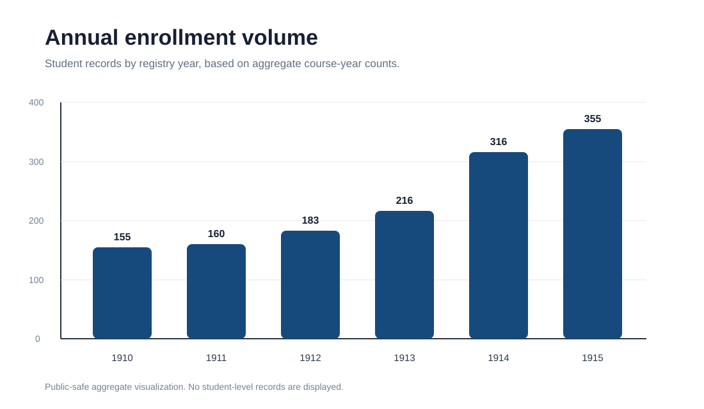
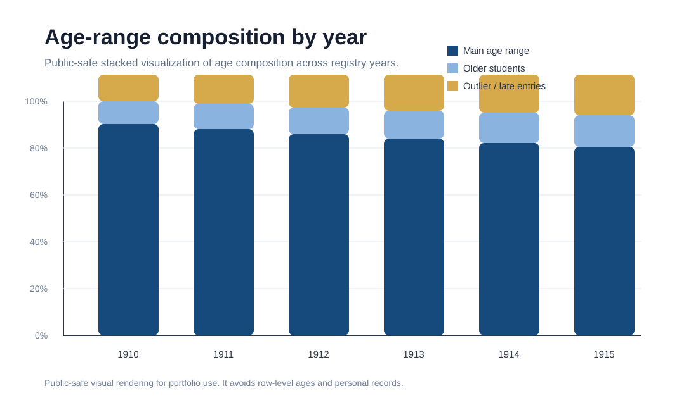
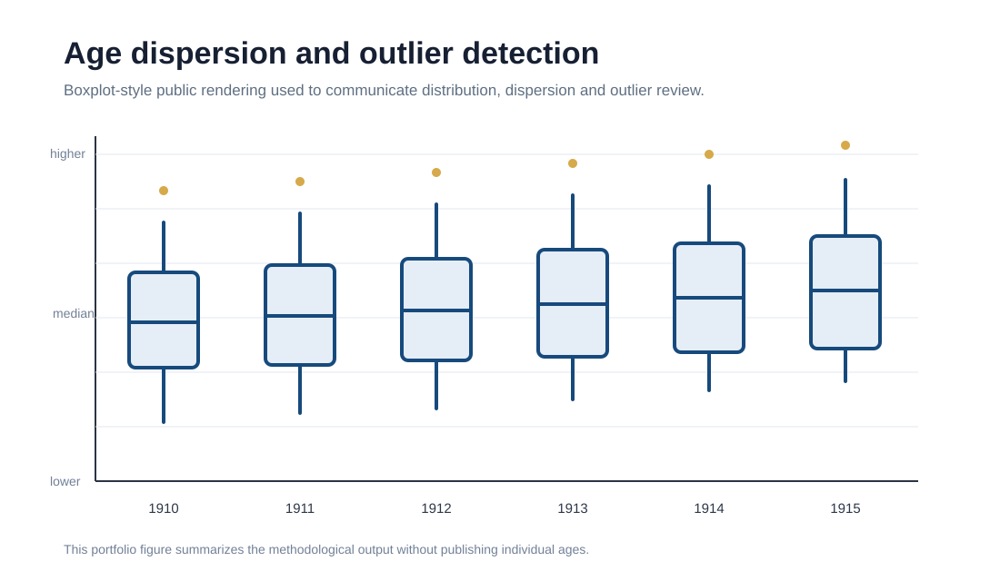
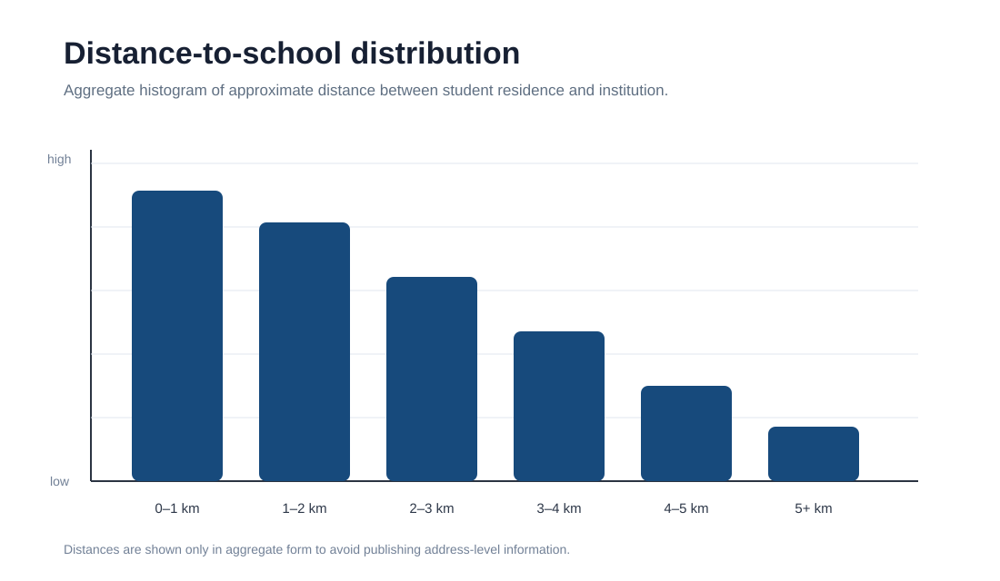
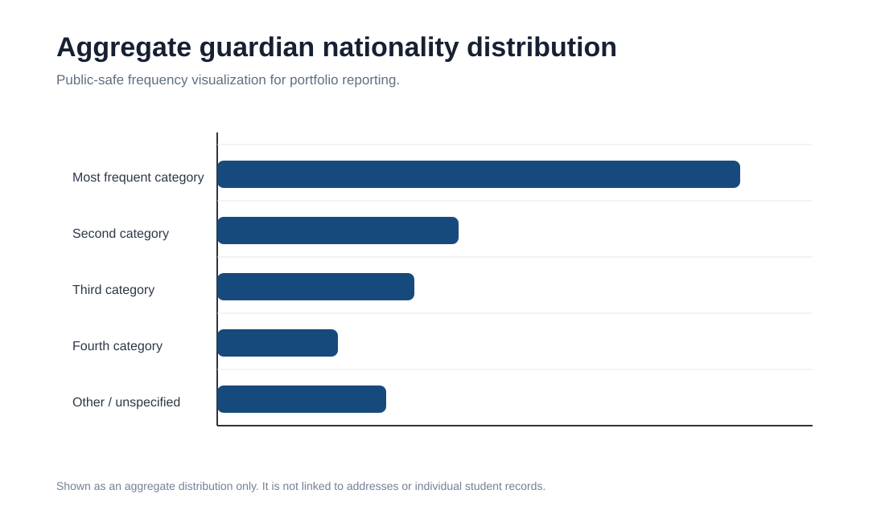

# School Enrollment and Geospatial Analysis

A privacy-preserving portfolio project based on quantitative and geospatial analysis of historical school enrollment records.

This repository presents a sanitized version of an institutional analytics workflow. It combines enrollment trends, age distributions, course-level patterns, spatial concentration analysis, distance-to-school estimation, and aggregate sociodemographic indicators.

## Live project page

The project can be viewed as a static portfolio page through GitHub Pages:

[`https://alexisfilosofia.github.io/school-enrollment-geospatial-analysis/`](https://alexisfilosofia.github.io/school-enrollment-geospatial-analysis/)

## Project goals

The project shows how Python can be used to transform fragmented institutional records into analytical outputs that support historical, educational and territorial interpretation.

The analysis focuses on:

- annual enrollment volume;
- age composition by year;
- age dispersion and outlier detection;
- entry course distribution by year;
- geospatial distribution of students;
- distance-to-school patterns;
- aggregate guardian nationality frequencies;
- privacy-aware reporting of sensitive educational data.

## Data privacy

The original datasets are not included.

They may contain sensitive institutional and student-level information such as names, addresses, family or guardian attributes and enrollment records. This public version includes only:

- sanitized notebooks;
- aggregate outputs;
- public-safe SVG figures;
- methodological documentation.

No raw student-level dataset is published in this repository.

## Selected outputs

The figures below are public-safe renderings for portfolio presentation. They avoid exposing row-level student records, addresses or sensitive individual information.

### 1. Annual enrollment volume



This chart summarizes the total number of student records by registry year, using aggregate course-year counts.

### 2. Age-range composition by year



This stacked visualization communicates the structure of age composition across years without exposing individual ages.

### 3. Age distribution and outlier detection



This boxplot-style rendering explains the distributional logic used in the notebook: median comparison, dispersion and outlier review.

### 4. Entry course frequency by year

The public version includes the aggregated course-year table as CSV and HTML:

- [`assets/tables/course_year_heatmap_table.csv`](assets/tables/course_year_heatmap_table.csv)
- [`assets/tables/course_year_heatmap_table.html`](assets/tables/course_year_heatmap_table.html)

This output supports the analysis of how student entry patterns vary across years and courses.

### 5. Distance-to-school distribution



This histogram-style visualization shows the approximate distance between student residences and the school at an aggregate level.

### 6. Guardian nationality distribution



This chart summarizes guardian nationality frequencies at an aggregate level, without linking categories to addresses or individuals.

## Repository structure

```text
school-enrollment-geospatial-analysis/
│
├── index.html
├── styles.css
├── README.md
├── requirements.txt
├── LICENSE
├── .gitignore
│
├── assets/
│   ├── screenshots/
│   └── tables/
│
├── data/
│   └── README.md
│
├── docs/
│   ├── methodology.md
│   ├── portfolio_description.md
│   └── github_pages_setup.md
│
└── notebooks/
    ├── 01_quantitative_enrollment_analysis_sanitized.ipynb
    └── 02_geospatial_analysis_sanitized.ipynb
```

## Web page

This repository includes a static portfolio page:

- [`index.html`](index.html)
- [`styles.css`](styles.css)

The page presents the main analytical outputs from the notebooks as a readable project report for recruiters, clients and portfolio reviewers.

## Technologies

- Python
- Pandas
- NumPy
- Matplotlib
- Folium
- GeoPandas
- Geopy
- Jupyter / Google Colab
- HTML
- CSS
- GitHub Pages

## Skills demonstrated

- Data cleaning and normalization
- Educational analytics
- Exploratory data analysis
- Time-series style institutional analysis
- Geospatial analysis
- Distance estimation
- Aggregate sociodemographic analysis
- Data visualization
- Static portfolio publishing
- Privacy-aware portfolio preparation

## How to use this repository

The notebooks are sanitized methodological versions. They document the analytical workflow without exposing the original sensitive files.

To adapt the project to another dataset:

1. Place anonymized or synthetic files in a local `data/` folder.
2. Adjust the data loading cells in the notebooks.
3. Keep row-level sensitive data out of public commits.
4. Export only aggregate tables, charts or anonymized spatial summaries.
5. Update the public-facing web page with safe visual outputs only.

## Ethical note

Educational and geospatial data can be sensitive, even when names are removed. Locations, nationality, family roles and institutional records can become identifying when combined.

For that reason, this repository is designed as a public portfolio version rather than a full data release.
