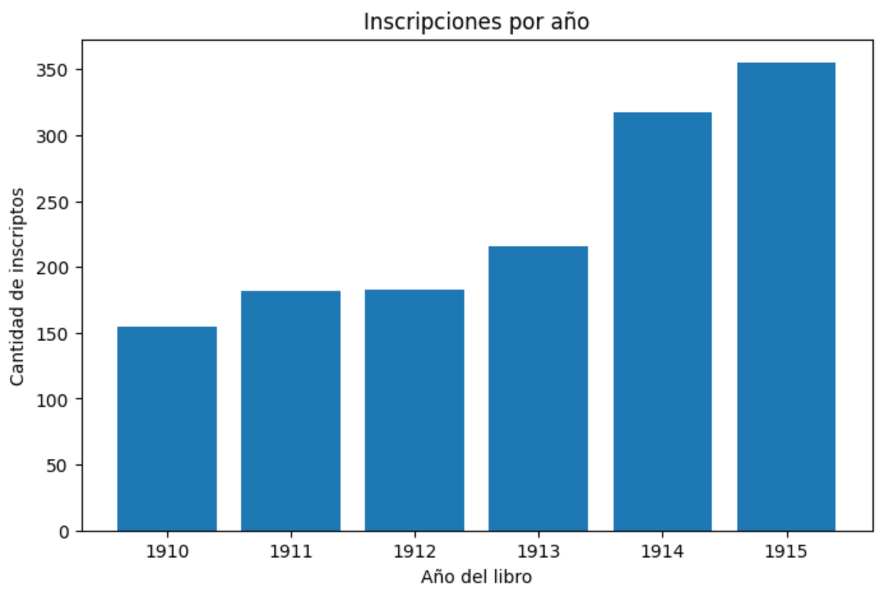
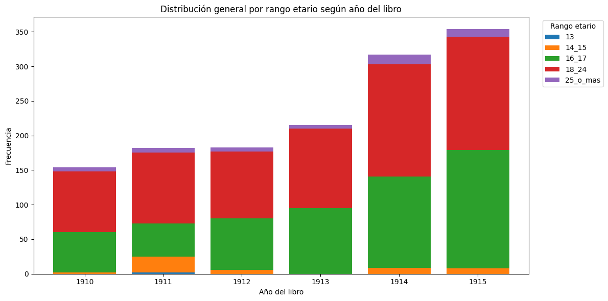
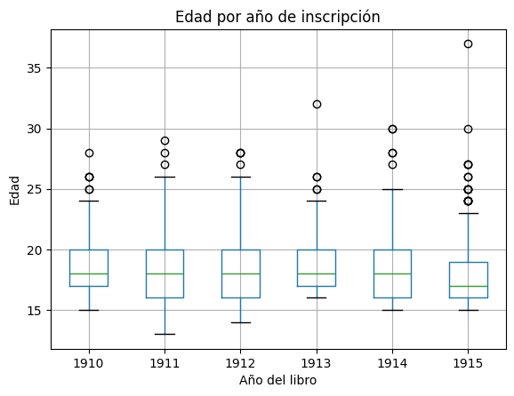
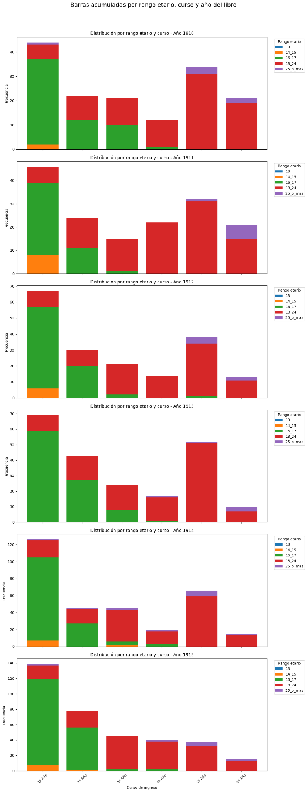
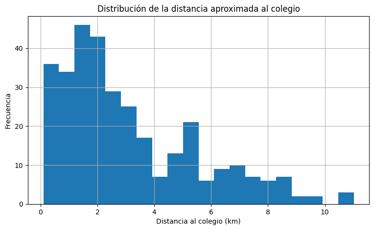
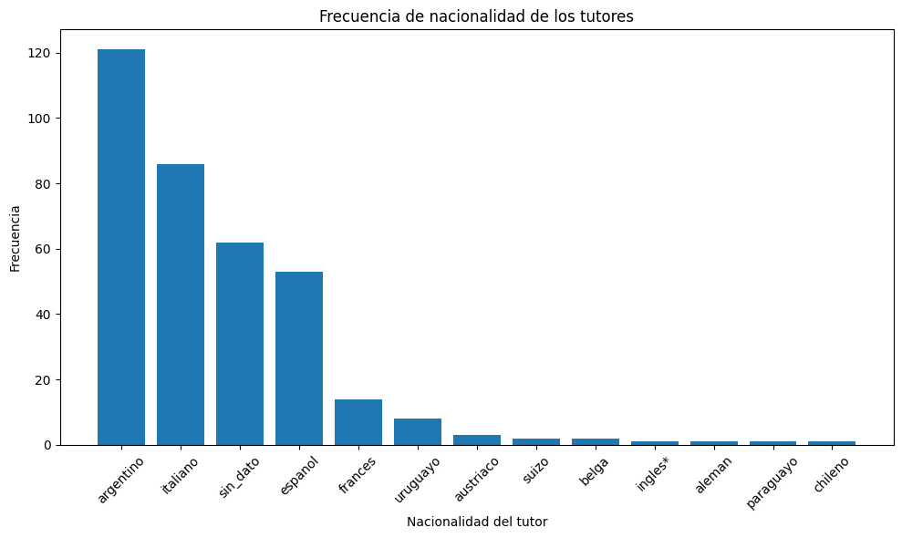
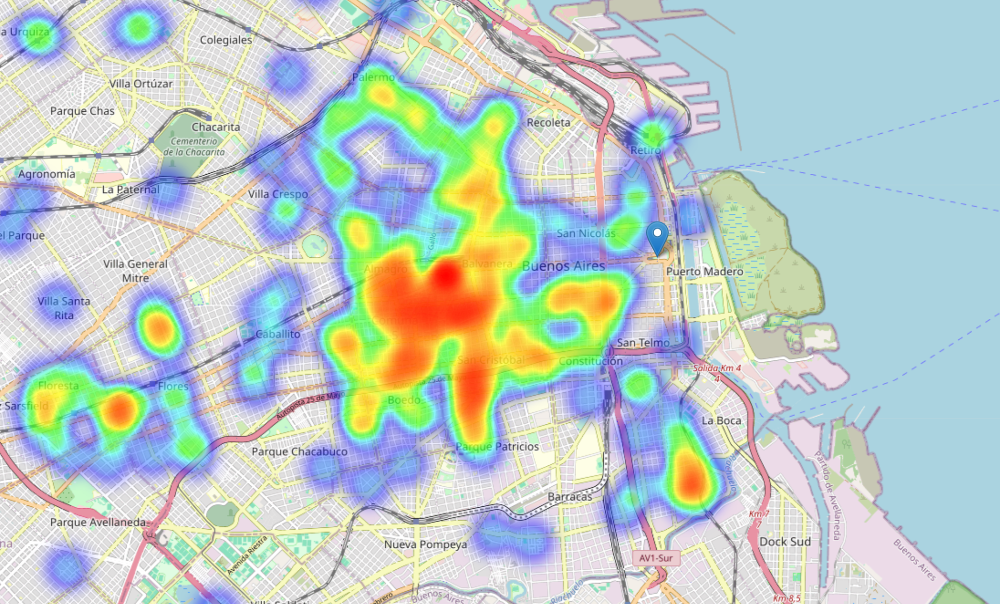
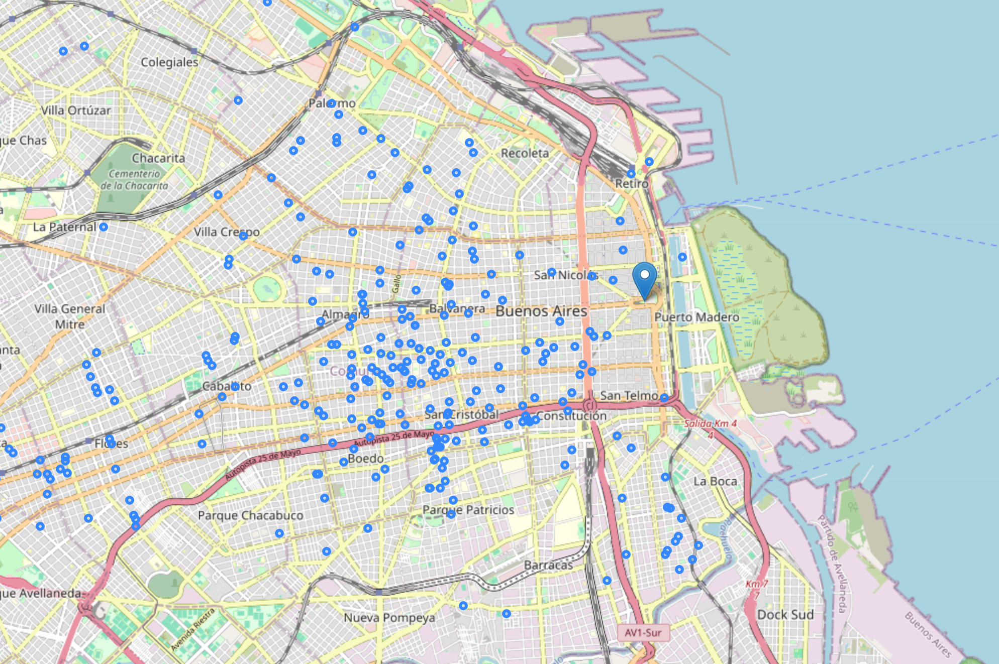

# School Enrollment and Geospatial Analysis

A privacy-preserving portfolio project based on two Google Colab notebooks for historical school enrollment analysis:

- `Archivo_PST_Cuanti.ipynb` — quantitative enrollment analysis.
- `Archivo_PST_GEO_Final.ipynb` — geospatial and socio-spatial analysis.

The public repository reorganizes those notebook outputs into a readable portfolio project. It keeps the analytical logic visible while avoiding publication of raw row-level records.

## Live project page

The project can be viewed as a static portfolio page through GitHub Pages:

[`https://alexisfilosofia.github.io/school-enrollment-geospatial-analysis/`](https://alexisfilosofia.github.io/school-enrollment-geospatial-analysis/)

## Project scope

The workflow consolidates historical enrollment spreadsheets and produces aggregate outputs for institutional, educational and territorial interpretation.

The notebooks document:

- consolidation of enrollment files from 1910 to 1915;
- normalization of heterogeneous course labels into six canonical entry courses;
- reconstruction and validation of dates;
- age cleaning and descriptive statistics;
- enrollment counts by year and by course;
- age composition by range, year and course;
- interannual variation in course enrollment;
- approximate distance analysis;
- guardian occupation summaries;
- student and guardian nationality summaries;
- methodological and privacy-aware export decisions.

## Data privacy

The original datasets are not included. This public version includes only:

- reusable Python modules;
- aggregate outputs;
- a synthetic/anonymized sample dataset;
- selected PNG figures exported from the Colab notebooks;
- public-safe SVG fallback figures;
- methodological documentation;
- a static web page for portfolio review.

Sanitized notebooks are planned as a future addition. They are not included in the current public repository.

No raw archival row-level dataset is published in this repository.

## Notebook-derived findings

### Dataset consolidation

The quantitative notebook consolidates `1,408` records and `22` columns across six enrollment files. Course labels are normalized into:

```text
1º Año, 2º Año, 3º Año, 4º Año, 5º Año, 6º Año
```

### Annual enrollment volume



Annual enrollment records increase from `155` in 1910 to `355` in 1915.

| Year | Records |
|---:|---:|
| 1910 | 155 |
| 1911 | 182 |
| 1912 | 183 |
| 1913 | 216 |
| 1914 | 317 |
| 1915 | 355 |

### Age structure





The age statistics are stable around late adolescence. The median age is `18` from 1910 to 1914 and falls to `17` in 1915. The maximum observed age reaches `37` in 1915, which is treated as an outlier requiring contextual interpretation rather than automatic deletion.

| Year | n with age | Mean | Median | Min | Max |
|---:|---:|---:|---:|---:|---:|
| 1910 | 154 | 18.86 | 18 | 15 | 28 |
| 1911 | 182 | 18.51 | 18 | 13 | 29 |
| 1912 | 183 | 18.57 | 18 | 14 | 28 |
| 1913 | 215 | 18.78 | 18 | 16 | 32 |
| 1914 | 317 | 18.70 | 18 | 15 | 30 |
| 1915 | 354 | 18.15 | 17 | 15 | 37 |

### Age ranges by course and year



This output disaggregates age ranges by entry course and registry year.

### Course-level enrollment dynamics

The course-year table shows a strong concentration in `1º Año`, especially from 1914 onward.

| Year | 1º Año | 2º Año | 3º Año | 4º Año | 5º Año | 6º Año |
|---:|---:|---:|---:|---:|---:|---:|
| 1910 | 44 | 22 | 21 | 12 | 35 | 21 |
| 1911 | 46 | 24 | 15 | 22 | 32 | 21 |
| 1912 | 67 | 30 | 21 | 14 | 38 | 13 |
| 1913 | 69 | 43 | 24 | 17 | 53 | 10 |
| 1914 | 126 | 45 | 45 | 19 | 66 | 15 |
| 1915 | 139 | 78 | 45 | 40 | 38 | 15 |

Between 1910 and 1915, `1º Año` grows from `44` to `139` records, while `2º Año` grows from `22` to `78`. `6º Año` decreases from `21` to `15`, suggesting that the expansion is concentrated more strongly in the lower entry courses.

### Geospatial and socio-spatial analysis



The geospatial notebook reports `323` cases, `77` spatial zones, and an approximate mean distance of `3.12 km`, with a median distance of `2.34 km`.



Student nationality is highly concentrated in the Argentine category (`326` records, `91.83%`). Guardian nationality is more heterogeneous: Argentine (`121`), Italian (`86`), missing/undetermined (`62`), Spanish (`53`) and French (`14`) are the most frequent categories.



The density heatmap is included as a public-facing spatial summary.

### Historical point map



This point-based map is included as a historical-geographic visualization because the records correspond to the 1910–1915 period.

## Reusable Python code

The repository now includes a lightweight `src/` layer that translates the Colab workflow into reusable Python modules:

- `src/data_cleaning.py` — column normalization, course canonicalization, age coercion, date parsing and public-safe column selection.
- `src/enrollment_analysis.py` — annual counts, course-year matrices, age statistics, age ranges and course-level change.
- `src/geospatial_analysis.py` — distance calculations, distance summaries, frequency tables and spatial-zone summaries.
- `src/visualization.py` — public-safe chart and HTML table exports.
- `src/run_public_analysis.py` — example command-line runner for anonymized or synthetic CSV files.

The original sensitive datasets are not included, so the runner is intended for anonymized, synthetic or locally provided data with equivalent columns.

## Reproducing the public sample analysis

Install the project dependencies, then run the public analysis script against the synthetic/anonymized sample dataset:

```bash
python src/run_public_analysis.py \
  --input data/sample_anonymized_enrollment.csv \
  --output outputs
```

This command writes reproducible aggregate outputs to `outputs/` using the public synthetic/anonymized sample dataset. The runner defaults are aligned with the sample columns: `registry_year`, `course` and `age`.

## Repository structure

```text
school-enrollment-geospatial-analysis/
│
├── index.html
├── styles.css
├── README.md
├── requirements.txt
├── LICENSE
├── .gitignore
├── .github/
│   └── workflows/
│       └── tests.yml
│
├── assets/
│   ├── screenshots/
│   └── tables/
│
├── data/
│   ├── README.md
│   └── sample_anonymized_enrollment.csv
│
├── docs/
│   ├── methodology.md
│   ├── notebook_output_audit.md
│   ├── code_structure.md
│   └── github_pages_setup.md
│
├── src/
│   ├── __init__.py
│   ├── data_cleaning.py
│   ├── enrollment_analysis.py
│   ├── geospatial_analysis.py
│   ├── visualization.py
│   └── run_public_analysis.py
│
├── outputs/
│   ├── README.md
│   ├── annual_enrollment_counts.csv
│   ├── course_year_matrix.csv
│   ├── course_change.csv
│   ├── age_statistics_by_year.csv
│   └── course_year_matrix.html
│
└── tests/
    └── test_enrollment_analysis.py
```

## Technologies

- Python
- Pandas
- NumPy
- Matplotlib
- Folium
- GeoPandas
- Geopy
- Jupyter / Google Colab
- HTML
- CSS
- GitHub Pages
- Pytest

## Skills demonstrated

- Data cleaning and normalization
- Educational analytics
- Exploratory data analysis
- Time-series style institutional analysis
- Geospatial analysis
- Distance estimation
- Aggregate sociodemographic analysis
- Data visualization
- Reusable Python module design
- Static portfolio publishing
- Privacy-aware portfolio preparation

## How to use this repository

Sanitized notebooks are planned as a future addition. The current public version documents the notebook-derived workflow through reusable Python modules, aggregate outputs and methodological notes.

To adapt the project to another dataset:

1. Place anonymized or synthetic files in a local `data/` folder.
2. Use `src/run_public_analysis.py` or adapt the reusable modules in `src/`.
3. Keep row-level sensitive data out of public commits.
4. Export only aggregate tables, charts or anonymized spatial summaries.
5. Update the public-facing web page with safe visual outputs only.

## Ethical note

Educational and geospatial data can be sensitive, even when names are removed. For that reason, this repository is designed as a public portfolio version rather than a full data release.
